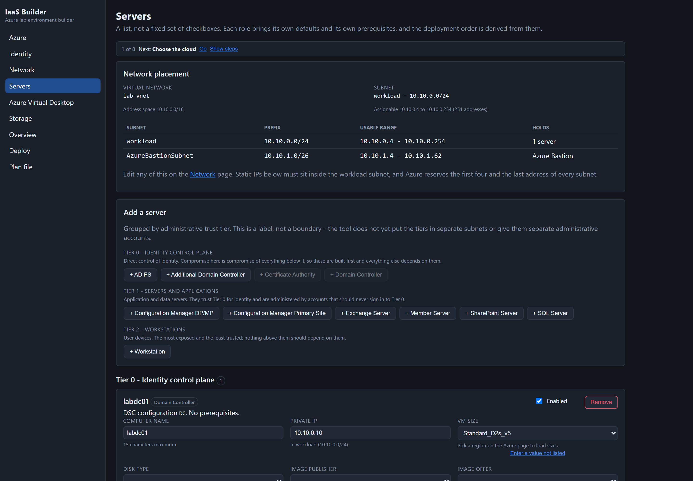

[](https://portal.azure.com/#create/Microsoft.Template/uri/https%3A%2F%2Fraw.githubusercontent.com%2Fchlaplan%2FIaaS-Builder%2Fmaster%2FTemplates%2FmainTemplate.json)

# IaaS Builder

Design an Azure IaaS lab environment — domain controllers, ADFS, Exchange, SharePoint, SQL,
SCCM, workstations, AVD and a SACA stack — validate it, and deploy it.

The tool is now a **local web application** that publishes to a **single self-contained
executable**, so it runs on a machine with no .NET install, no package feed and no internet.
Plans can be authored, validated and saved completely offline; a connection is only needed to
actually deploy or to refresh the resource catalog.



---

## Quick start

```powershell
dotnet build
dotnet run --project src\IaaSBuilder.Web
```

A browser opens at the address printed in the console. Pass `--no-browser` to suppress that.

**There is nothing to upload or host.** It is a web *interface*, not a web *site*: the server runs
on your own machine and binds to loopback (`127.0.0.1`) only. That is deliberate — the process
holds your Azure credentials and the domain administrator password, so it must not be reachable
from the network unless somebody chooses to host it. To give the tool to someone else, hand them
the self-contained executable below; they run it on their own box.

> While the app is running it holds a lock on `IaaSBuilder.exe`. Stop it (Ctrl+C, or stop the
> debugger) before rebuilding, or the build fails with `MSB3027: could not copy ... apphost.exe`.

### Debugging in Visual Studio

Set **IaaSBuilder.Web** as the startup project, configuration **Debug**, profile **http**, then F5.
It opens `http://localhost:5234`. The other projects are not runnable: `IaaSBuilder.Core` is a class
library, `IaaSBuilder.Core.Tests` runs through Test Explorer, and `IaaSBuilder.Cli` is the headless
deployer.

> **If F5 fails with `Could not load file or assembly 'System.Runtime, Version=10.0.0.0'`**, first
> find out whether the *build output* is bad or whether **Visual Studio's launch** is bad. They look
> identical in the IDE but have completely different fixes. Run the app from a terminal:
>
> ```powershell
> dotnet run --project src\IaaSBuilder.Web
> ```
>
> **If that also fails**, the output folder is in a *self-contained* layout. An earlier
> `dotnet publish -c Release` writes a RID-specific, self-contained build to
> `bin\Release\net10.0\win-x64\` and rewrites the shared `obj\` restore assets along the way; a later
> framework-dependent Debug build then expects runtime assemblies that are not there. A healthy
> `bin\Debug\net10.0` has roughly **28 files**, a self-contained one around **380** — the quickest
> way to tell which you are looking at. Stop any running `IaaSBuilder.exe`, then:
>
> ```powershell
> Get-ChildItem src,tests -Include bin,obj -Recurse -Directory | Remove-Item -Recurse -Force
> dotnet build
> ```
>
> **If `dotnet run` works but F5 still does not**, the build is fine and the fault is in Visual
> Studio's cached solution state, which for `.slnx` solutions lives in `.vs\`. Close Visual Studio
> and delete `.vs\slnx.sqlite`, `.vs\ProjectSettings.json` and `.vs\IaaS-Builder.slnx\config\`, then
> reopen. They are regenerated. Note that a *host*-level problem — a genuinely missing or mismatched
> runtime — produces a friendly `You must install or update .NET to run this application` message
> instead, so a managed `FileNotFoundException` rules that out.
>
> Until F5 is working, `dotnet run --project src\IaaSBuilder.Web` is a complete substitute: it is the
> same app, and you can still attach the debugger with **Debug > Attach to Process > IaaSBuilder**.

### Page order

The sidebar follows the order things get built, ending with a review step:

**Azure → Identity → Network → Servers → Azure Virtual Desktop → Storage → Overview → Deploy**

`Overview` shows what is about to be built, so it sits immediately before `Deploy`. `Plan file`
(save/load) is available at any point.

`Identity` (domain, administrator account and password) and `Storage` (the DSC staging account,
or pre-staged artifact overrides) used to live at the bottom of the Azure page. They are separate
pages now: Azure had grown to cover sign-in, subscription, region, resource group, identity *and*
artifact staging, which is four unrelated decisions on one screen.

### Fields validate as you type

Every field checks itself against the same rules that gate the deployment. A value that breaks one
turns the box red and prints the reason underneath — `Storage account names must be 3-24 lowercase
letters and digits`, `15 characters maximum`, and so on — and the **Deploy** button stays disabled
until it is fixed. The Deploy page lists everything outstanding with a link to the page that edits
it, so `artifacts.storageAccountName` does not require knowing where that lives.

Two deliberate quiet cases:

- **Nothing is red on a first visit.** The choice fields start blank (see *Saved settings* below),
  so validating them immediately would open the form on a wall of red describing work you have not
  had a chance to do.
- **A disabled server is not validated.** It will not be deployed, so it cannot block one that
  will. Its fields go red the moment you enable it.

The rules themselves live only in `DeploymentPlanValidator`. A field declares *which* value it
edits, as the path the validator already reports (`Path="artifacts.storageAccountName"`), and asks
what is wrong with it — so the message you see inline is the same one that blocks the deployment,
and any rule added later lights up its field with no UI change.

### Picking a VM size, and what it will cost

The **VM size**, **disk type** and the three image fields on the Servers page are real dropdowns,
not text boxes with a suggestion list. Opening the size list shows **every size the region offers**
— around 950 in `usgovvirginia` — grouped by series, with cores, memory and a monthly estimate on
each option.

Two properties of those dropdowns are deliberate and worth knowing:

- **A value that is not in the catalog is kept, not silently replaced.** A plan file naming a size
  this snapshot has never heard of still shows that size, labelled *not in the catalog for this
  region*. Quietly substituting something else would build a different lab from the one the file
  describes.
- **You can still type a value that is not listed.** An enclave's catalog snapshot can lag what the
  region actually offers, so every open-ended field keeps an *Enter a value not listed* escape.
  Closed sets, such as disk type, do not — there is no fourth kind of managed disk to type in.

**Disk type follows the size.** Roughly 125 of the sizes in `usgovvirginia` — every `A`-series size
among them — cannot take Premium SSD at all. Azure rejects that combination at VM creation time,
minutes into a deployment:

```
InvalidParameter: the VM size Standard_A2_v2 does not support the storage account type Premium_LRS
```

So the disk list is filtered to what the selected size supports, changing to an incompatible size
**corrects the disk downward automatically** and says on the page that it did, and the deploy gate
refuses the combination if a plan file arrives carrying it. The auto-correction lands on **Standard
SSD**, not Standard HDD — the cheapest option that is not a performance cliff.

One distinction the code keeps carefully: "this size cannot take Premium" and "this snapshot does
not say whether it can" are **not** the same thing. A snapshot captured before this field existed
knows nothing about Premium support, and treating that as *no* would report every size in an
air-gapped enclave as incapable. Unknown means every disk type stays on offer.

#### Prices

Prices come from the **public retail price feed** (`prices.azure.com`), which needs no sign-in and
serves sovereign regions. They are Windows pay-as-you-go **compute only** at 730 hours a month —
no disks, no bandwidth, no Bastion — so treat the plan total as a way to compare sizes, not as a
bill. Prices are cached on disk beside `catalog.json` and re-fetched when they are more than 30
days old.

`prices.azure.com` is a different host from Resource Manager, so a network that permits the
management plane may still not permit this. **Show VM prices** on the Azure page turns the whole
thing off, is remembered between sessions, and is deliberately *not* overwritten when you load a
plan file — it is a preference about outbound traffic, and opening a file is no reason to start
reaching out again. With it off, or with the feed unreachable, sizes simply carry no price. Nothing
about pricing can fail a validation or block a deployment.

### Trying it without an Azure subscription

`init`, `validate` and `plan` never contact Azure, so they are the fastest way to exercise the
logic. `plan` prints the dependency graph and the waves that run concurrently:

```powershell
dotnet run --project src\IaaSBuilder.Cli -- init     --out plan.json --prefix lab --domain contoso.local
dotnet run --project src\IaaSBuilder.Cli -- validate --plan plan.json --content-root .
dotnet run --project src\IaaSBuilder.Cli -- plan     --plan plan.json --content-root .
```

`whatif` is the first command that needs a subscription; it validates every template against ARM
without creating anything.

### Signing in

Two options on the **Azure & Identity** page:

- **Sign in with device code** — the tool asks Microsoft Entra ID for a short-lived code and shows
  it. You open the sign-in page in another tab, paste the code, and authenticate there as normal
  (password, MFA, smart card). The tool polls in the background and completes on its own. Nothing
  is typed into this application, and it never sees your password — that is the point of the flow,
  and it is why it works on a hardened jump box with no usable browser.
- **Use ambient credential** — reuses whatever the machine already has: `az login`, a managed
  identity, or `AZURE_CLIENT_ID`/`AZURE_CLIENT_SECRET`. This is the CI path.

The device code page is **per cloud** and the tool picks it from the *Cloud* selector, which is why
that selector sits at the top of the **Sign in** panel and locks as soon as a sign-in starts:

| Cloud | Sign-in page |
|---|---|
| Azure commercial | `https://login.microsoft.com/device` |
| Azure US Government | `https://login.microsoftonline.us/device` |

A code lasts about 15 minutes. If it expires, just sign in again.

**Choose the cloud first.** Changing it after signing in means signing out, so the selector is
disabled while signed in or while a sign-in is running. If you start one against the wrong cloud,
press **Cancel sign-in** — it returns you to signed-out and unlocks the selector. There is no need
to restart the app, and cancelling is not reported as a failure.

Changing the cloud clears the subscription, the region and the cached catalog, because commercial
and US Government share no subscription ids and no region names.

### Walking through a deployment

Every page carries a **Getting started** checklist at the top. It is a checklist, not a wizard: it
reads the real plan, marks off what is already satisfied, highlights the one step to do next and
offers a **Go** button to the page that step lives on. It never blocks navigation, so loading a
saved plan does not mean clicking through nine screens. It **starts collapsed** to a single line
showing progress and the next step, stays however you leave it as you move between pages, and
disappears entirely once every step is done.

The matching **block of controls is highlighted on the page as well**, labelled *Do this next*, so
you are not left reading "Pick a region" and then hunting for the region box among a dozen fields.

**The form starts blank, on purpose.** Subscription, region, resource group, domain name and
administrator username are *choices*, not defaults — nobody decided that your lab belongs in
`eastus` and is called `contoso.local`. Worse, prefilling them ticks "Pick a region" off the
checklist before you have picked anything, so the checklist lies about where you are. Engineering
defaults — address spaces, subnet prefixes, VM sizes, disk types, image versions — stay filled in,
because those are defaults in the real sense: right until you have a reason to change them.

Press **Save these settings** on the Azure page once you have made your choices and they come back
on your next visit. They are stored in your browser only (never on the server, so on a hosted
instance one visitor's subscription id can never be shown to another), and the **administrator
password is never included**. **Forget saved settings** clears them.

Validation stays quiet until you edit something — see *Fields validate as you type* above.

1. **Azure** — pick the cloud, sign in, then set the subscription, region and resource group.
   Once signed in the subscription becomes a list of what your account can actually see, and the
   resource group box suggests the groups in that subscription; see below.
2. **Identity** — the domain the lab builds and the administrator account the DSC configurations
   run as. The password box has a **Generate** button — it produces a 20-character password that
   satisfies both Azure's rules and the characters the ARM → DSC → PowerShell path can carry
   safely. A generated password is **shown**, not hidden, and warns you to record it: it is held
   in memory only and never written to the plan file, so one you cannot read locks you out of your
   own lab.
3. **Network** — address space and subnets. Azure reserves the first four addresses of a subnet,
   which the validator enforces. The **address space** is the virtual network's own range and the
   subnets are carved out of it; if a subnet drifts outside it, a one-click **Fit the subnets to
   the address space** button appears. **Microsoft SACA lives on this page too**, because it decides
   how the servers are wired; see below.
4. **Servers** — add roles. Each maps to a DSC configuration inside `DSC/Configuration.zip`.
   Roles are grouped by **administrative trust tier** — Tier 0 identity (domain controllers, AD FS),
   Tier 1 servers and applications, Tier 2 workstations — so it is obvious that a domain controller
   is not the same kind of thing as a client. This is a **label, not a boundary**: the tool does not
   yet put the tiers in separate subnets or give them separate administrative accounts. Saying so
   matters, because a tier model you believe in but have not implemented is worse than none.
   The page opens with a **Network placement** panel restating the virtual network, the subnets
   and each subnet's assignable range, because the static IPs you type here only mean anything
   against a subnet defined on the previous page. It updates as you edit the Network page, flags a
   subnet that has fallen outside the address space, and each **Private IP** box says whether the
   address is inside the workload subnet, reserved by Azure, or already taken by another server.

   A new plan contains **one server: the domain controller**. Nothing else is seeded — a client used
   to be added disabled, which still put a Workstation card on every new lab and read as if a client
   were part of the build.

   **Domain Controller** can only be added once: a forest has one first domain controller, and the
   button says so and points at **Additional Domain Controller**, which is unlimited. The validator
   still rejects a plan file that contains two, because the button only guards the add path.

   Each server card carries a **Role settings** block showing what that role's DSC configuration
   actually consumes: the editable values it reads from the plan (domain name, AD FS service
   account, SharePoint version) and the values derived from the rest of the plan (the domain
   controller it will join, the SQL server it will use, the primary site it will report to,
   whether hardening is applied). A derived value that cannot be worked out is shown as a warning
   rather than left blank — "no enabled SQL Server, which SharePoint requires" is a gap in the plan,
   not an empty field.
5. **Azure Virtual Desktop** — optional.
6. **Storage** — where the DSC package is staged. You can leave this alone: the account is created
   for you with a fresh name each run. Set **Storage resource group** to reuse a long-lived account
   you already have blob access on, so a role grant survives from one lab to the next. It is a page
   of its own because the air-gapped path lives here — tick **skip upload** and supply a pre-staged
   location and SAS token instead.
7. **Overview** — check what is about to be built.
8. **Deploy** — run **What-if (validate only)** first. It sends every template to ARM for
   validation and creates nothing, which is the cheapest way to catch a bad image SKU or a
   quota problem. Then run the real deployment.

The **Deploy** button is disabled while any field is invalid, and the page lists what is
outstanding with a link to the page that fixes each one. Previously it only required a sign-in and
a password, so a plan with a bad value would start, create the resource group and the network, and
fail at the step that finally used it — the half-built-resource-group problem the prerequisite
check exists to avoid, one layer up.

Artifacts are handled for you: the *Publish DSC artifacts* step creates a storage account,
uploads `Configuration.zip`, mints a short-lived read-only SAS token and hands the VM extensions
a SAS URL. The container is private and public blob access is disabled on the account, so the
token is what makes the package readable from inside the VM.

### Permissions you need

**Contributor on the subscription is enough.** You do not need to grant anything extra.

| To do this | You need |
|---|---|
| Create the resource group, network, VMs | **Contributor** on the subscription or resource group |
| Stage the DSC package | Nothing extra — see below |

Subscription **Owner and Contributor grant no access to blob data**, which is a genuine gap: their
`dataActions` list is empty, so uploading the DSC package with your own Entra identity fails with
`403`. The obvious fix is to grant **Storage Blob Data Contributor**, and for a long time that is
what this tool told you to do.

It no longer asks. The tool creates the staging account itself moments earlier, so it falls back to
that account's own access key:

1. It tries Entra first, and mints a **user delegation SAS** when the blob data role is present.
   That SAS is bound to your identity and independently revocable, so it stays the preferred path.
2. On a real `403` it calls `listKeys` on the account it just created and signs with a shared key
   instead. `listKeys` is a control-plane action matched by Contributor's `actions: ["*"]`, so it
   works immediately, with no new role assignment and no waiting for propagation.

Automating the role grant would have been the worse answer: creating a role assignment itself needs
**Owner** or **User Access Administrator** (Contributor is explicitly denied
`Microsoft.Authorization/*/Write`), it is a standing privileged permission to hold, and assignments
take minutes to take effect. Making the grant unnecessary beats automating it.

The preflight reflects this. A missing blob data role is now a **warning**, not a blocker, when
`listKeys` is available. It only blocks when **both** are unavailable.

#### When the fallback is not available either

There are two quite different reasons the account-key fallback can fail, and they need different
fixes, so the tool now determines which one actually happened instead of listing both:

- **`listKeys` was refused.** The ordinary case. Grant **Storage Blob Data Contributor** and retry.
  The tool prints the exact `az role assignment create` command, scoped to the resource group that
  actually holds the staging account, along with the underlying HTTP status and error code from the
  `listKeys` call — Contributor *should* have that action, so if it is being refused the reason is
  the only thing that makes the next attempt cheaper. Rather than re-granting on every new lab,
  nominate a long-lived staging account (see below) so one grant covers every run.
- **The account has `allowSharedKeyAccess = false`.** Almost always the Azure Policy *"Storage
  accounts should prevent shared key access"*. This one is worse than it looks: with shared key
  disabled, **service and account SAS are refused too**, so the read SAS the DSC extension needs
  to fetch the package is dead as well. Granting only the blob data role fixes the upload and then
  fails at the SAS. You need **Storage Blob Data Contributor** *and* **Storage Blob Delegator** —
  the latter is a separate role that allows generating a user delegation SAS, and it is **not**
  included in the former.

If policy prevents you holding those roles at all, use the offline path: `artifacts.skipUpload`
with `artifactsLocationOverride` and `artifactsSasTokenOverride`, pointing at a pre-staged copy.

#### Where the DSC package comes from

**By default nothing is uploaded to Azure at all.** The Storage page ships with *Download the
published package* turned on, pointing at the copy in this repository:

```
https://raw.githubusercontent.com/chlaplan/IaaS-Builder/master/DSC/Configuration.zip
```

That copy is byte-identical to `DSC/Configuration.zip` here (SHA-256
`FC8D6E7E9D298EC51C8F766035DF1D75A2EF352D20AD1402B26F6444ED903825`, 4,133,171 bytes), so there is
nothing to upload when the local package changes unless you change the package itself.

**This cuts both ways.** Because the default source is the copy on `raw.githubusercontent.com`, a
change to `DSC/Configuration.zip` in a working tree has no effect on a deployment until it is
committed and pushed. Until then the VMs keep downloading the previous package, and a fix that
looks applied locally will appear not to work.

With it on, no staging account is created, no SAS is minted and **no role assignment of any kind is
needed** — the whole class of `Storage Blob Data Contributor` failures disappears. The VMs need
outbound access to that URL, which a staged blob equally required. Point the **Package URL** field
at your own server if GitHub is unreachable; the link is checked with an HTTP request *before*
anything is created, so an unreachable package stops the run rather than producing VMs that build
and then silently never configure.

The path is a template parameter (`dscPackagePath`) rather than the hard-coded `dsc/Configuration.zip`
it used to be, because `raw.githubusercontent.com` is **case sensitive**: `DSC/Configuration.zip`
serves the file and `dsc/Configuration.zip` returns 404. Rebuilding the URL from a lowercase
constant would have produced a 404 *inside the VM*, after every machine had been built.

The pre-check can only confirm the package is reachable **from this machine**. A VM with no
outbound access will still fail later, which is what the fallback URL field is for.

#### What is inside the package, and why the tests read it

The package is a binary blob. Nothing in it is compiled, and nothing about it shows up in a diff,
so a defect inside it is invisible until a VM fails half an hour into a deployment. That happened:
a domain controller failed with

```
No mapping between account names and security IDs was done. (16,8):UserId:
```

The error names the page-file resource, but that is only the first of several errors the extension
concatenates. The actual fault was two `ScheduledTask` resources in `DCConfiguration.ps1` that ran
as `contoso.com\admin` and declared **no `DependsOn`**, so the LCM tried to register them while the
machine was still a workgroup member and the forest did not exist yet. Task Scheduler resolves a
principal through `LookupAccountName`; with no domain, there is no SID, and the run fails. The
`(N,8):UserId:` suffix is Task Scheduler reporting the line and column of the `<UserId>` element in
the task XML it rejected.

Worse, the two tasks ran the STIG and Microsoft-baseline scripts, both of which **begin with an
"if enabled" test** — and both switches default to off. An ordinary lab was failing while trying to
schedule work that would have done nothing.

Three things were changed, and `DscPackageContentTests` reads the archive to keep them that way:

| Fix | Guarded by |
|---|---|
| Hardening tasks are only declared when the matching switch is on, and depend on the domain | `The_domain_controller_only_schedules_hardening_when_it_was_asked_for` |
| **Any** scheduled task running as a domain account must declare a `DependsOn` — stated as a rule, not as a match on the two that were wrong | `Every_scheduled_task_running_as_a_domain_account_is_ordered_after_the_domain` |
| Task principals use the down-level `NETBIOS\user` form that `LookupAccountName` expects | `The_domain_controller_schedules_tasks_under_a_netbios_principal` |

The general rule caught a third instance immediately: `Exchange2019Configuration.ps1` registered its
install task as a domain account with no dependency on the domain join, the same bug in a role
nobody had run recently.

The page-file resource was rewritten as well. It is a hand-rolled copy of
`ComputerManagementDsc\VirtualMemory` that an upstream commit added in 2019 to drop an external
module dependency, and it had drifted: it wrote through `Set-WmiInstance`, which is deprecated and
absent from PowerShell 6 and later, and it handed a whole `Win32_ComputerSystem` instance back to
`Set-CimInstance`, which re-submits every writable property. It now uses the same `-Query` and
`New-CimInstance` calls the maintained resource uses, and — more importantly — it is wrapped in a
`try`/`catch`. An Azure Windows image already has a page file, so its size is a convenience and must
never be able to fail an entire build.

#### Where the certificate authority goes

An Active Directory forest has exactly one enterprise root CA, so the **Identity** page offers a
choice rather than a tick list:

| Choice | What is built |
|---|---|
| **Install on the domain controller** (default) | What every previous version did. The DC's DSC configuration installs the CA after the forest is up. |
| **Install on a dedicated Certificate Authority server** | A Tier 0 CA server, added on the **Servers** page, which joins the existing domain and installs the CA there. The DC installs none. |
| **Do not install a certificate authority** | No CA. Anything that needs certificates — AD FS, Exchange, LDAPS — has to get one elsewhere. |

The default is *install on the domain controller* deliberately: a plan file written before this
setting existed deserializes to the enum's default, and an existing lab must come back the same.
A CA on a domain controller is a lab convenience, not a pattern to copy into production.

Three things had to change together, and each is guarded:

- **The package gained `CAConfiguration.ps1`.** The CA role used to point at the `DC` token, which
  was wrong — `DCConfiguration.ps1` runs `SetupDomain FirstDS`, so a "Certificate Authority" server
  promoted a second machine to a forest root for a domain that already existed. That is why the role
  was withdrawn. The new script *joins* the domain and installs `ADCS-Cert-Authority` there.
- **`InstallCA` in `DCConfiguration.ps1` is conditional.** Wrapping a DSC resource in an `if`
  removes it from the configuration entirely, so the two hardening tasks that used to depend on
  `[InstallCA]InstallCA` now depend on `[SetupDomain]FirstDS` — which was the real requirement
  anyway. This is the opposite of the ARM rule: ARM removes an undeployed conditional resource from
  `dependsOn` for you, DSC does not.
- **All 14 configurations take an `$InstallCA` parameter.** The extension splats the template's
  `Properties` block onto the configuration function, so a key that any one script does not declare
  fails the whole run. It is non-mandatory with a default of `'false'`, so an older template that
  does not pass it builds a lab without a CA instead of failing outright.

Both directions are validation **errors**, because each one silently builds the wrong lab: a CA
server while the DC is also installing one gives the forest two enterprise roots, and a dedicated
placement with no CA server gives a domain-joined machine that is never made a CA. The **+
Certificate Authority** button on the Servers page is disabled, with the reason as its tooltip,
until the placement is set — the refusal lives in `PlanFactory.CanAddServer`, so the CLI and the
web UI cannot disagree about it.

#### Workarounds when storage is not allowed at all

The DSC extension needs the configuration package at an **HTTPS URL it can reach from inside the
VM**. It does not care that the URL is an Azure blob. So there is more than one way out, in
increasing order of effort:

0. **Leave the published package URL on** — the default, described above. No storage, no roles.
1. **Nominate a storage account you already have rights on.**
   **Storage resource group** field. Leave it blank and the tool creates a fresh staging account,
   with a new random name, inside the lab's resource group — which is exactly why a
   `Storage Blob Data Contributor` grant never seemed to help: the account it applied to did not
   exist any more on the next run. Point it at a long-lived account instead and the grant is made
   **once** and reused for every deployment. The account must already exist; if it does not, the
   run stops before creating anything rather than quietly making a new account in a resource group
   you share with other people.
2. **Host the package on your own website.** `artifacts.skipUpload` with
   `artifactsLocationOverride` pointing at any HTTPS location that serves `dsc/Configuration.zip`.
   No Azure storage is involved at all. Add `artifactsSasTokenOverride` only if that location needs
   a credential.
3. **Pre-stage it in the enclave** — the same two settings, pointing at whatever internal location
   already holds the package. This is the air-gapped path and needs no outbound access.

What is *not* a workaround: automating the role grant. Creating a role assignment needs **Owner**
or **User Access Administrator**, which Contributor is explicitly denied. Nor does creating the
storage account differently help — the tool already creates it, and granting a role on it at
creation time is the same privileged write.

Longer term, the mechanism that removes the storage dependency entirely is the managed **Run
Command**, which takes an inline script in the ARM template and needs only
`Microsoft.Compute/virtualMachines/runCommand/write` — a permission Contributor already has. See
*Is DSC still the right mechanism?* below for why that is a design job rather than a port.

Every deployment still starts with a **Check subscription prerequisites** step that runs on its own,
before anything is created. It reads the blob data role at the narrowest scope that exists, the
registration state of every resource provider the plan will touch, and — for Mission Landing Zone —
the `EncryptionAtHost` feature. If any of them would stop the run it fails immediately, lists
**everything** that is wrong in one go, and every later step is skipped, so no resource group,
network or storage account is left behind.

A preflight that cannot read the subscription never blocks a deployment that would have worked: a
tenant can deny those read APIs to an account that is still perfectly able to deploy, so an
unreadable check is reported as a note and the run continues.

When a deployment does fail, the tool follows up by asking ARM for the individual deployment
operations — including one level of nested deployments — and reports the failing resource, its
type, and the real error code and message. ARM's own top-level message is
`At least one resource deployment operation failed`, which on its own says nothing about what
broke.

The SAS is a *user delegation* SAS, signed with your Entra credentials rather than a storage
account key, so it still works in tenants where `allowSharedKeyAccess` is disabled by policy —
which is normal in DoD tenants. It is scoped to the staging container, read-only, HTTPS-only,
and valid for 12 hours.

For a pre-staged or air-gapped run, set `artifacts.skipUpload` with
`artifacts.artifactsLocationOverride` and `artifacts.artifactsSasTokenOverride` instead. The
validator warns if you point at a blob URL with no token, since that container is private by
default and the failure would otherwise appear inside the VM long after ARM reports success.

### Public IPs on the VMs, and Azure Policy

**The VMs get no public IP by default.** The built-in policy *Network interfaces should not have
public IPs* (`83a86a26-fd1f-447c-b59d-e51f44264114`) is assigned with a **deny** effect in many
enterprise and government tenants, and a denial rejects the **entire VM deployment** — the network
interface, the VM and its DSC extension — not just the address:

```
RequestDisallowedByPolicy: Resource 'lablabdc01-ni' was disallowed by policy.
Reasons: 'Per policy, network interfaces should not have public IPs.'
```

Azure Bastion reaches the VMs over the virtual network without one, which is why the address is now
a template parameter (`assignPublicIp`) rather than a fixed resource. Turn it on with **Give each VM
a public IP** on the Network page if your tenant permits them; the validator warns either way, and
warns separately if you switch Bastion off *and* leave public IPs off, because that builds machines
nobody can sign in to.

This was already half-fixed by hand: the SACA template carried the public IP block commented out,
in one of the three VM templates. All three now share one switch.

When ARM refuses a deployment on policy grounds it does so **before creating anything**, so there
are no deployment operations to read back and the usual error detail is empty. The policy reason is
lifted out of the raw response and shown with the setting to change.

Two details that only matter when you *do* turn it on:

- The address is a **Standard SKU** with **static** allocation. Basic SKU public IPs were retired on
  30 September 2025, and a public IP with no `sku` defaults to Basic, so the template as shipped
  would have failed to create one at all. Standard SKU also requires static allocation, which is why
  `publicIpAllocationMethod` is no longer `Dynamic`.
- The network security group has **no inbound rules**, so a public IP gives the VM an address, not
  access. That is deliberate: opening RDP to the internet on a lab domain controller is not a
  default worth shipping. Bastion remains the way in.

`dependsOn` is a plain array, not an expression. ARM deserialises it into a typed array *before* it
evaluates anything, so a string there - even a correct expression returning an array - is rejected
with `InvalidRequestContent` and the deployment never starts. No conditional expression is needed:
when a resource's `condition` is false, ARM removes it from its dependents' required dependencies
automatically.

### What is loaded once you sign in

Signing in turns the Azure page from "paste a GUID" into a set of lists, in this order:

| Loaded | Where it appears |
|---|---|
| Subscriptions visible to the account | **Subscription** becomes a dropdown, showing name and id. If exactly one is visible and none is chosen, it is selected for you. Disabled or warned subscriptions are labelled, because Azure will refuse a deployment into them. |
| Tenant id of the chosen subscription | Fills **Tenant id** if you left it blank. A value you typed is never overwritten. |
| Resource groups in that subscription | **Resource group** suggests existing groups. It stays a free-text box, so typing a new name is how you create one — the hint tells you which you are doing, and the region an existing group is in. |
| Regions, VM sizes, image SKUs | The catalog, refreshed for the chosen subscription. |

Choosing a subscription cascades: tenant, resource groups and catalog all reload. **Refresh from
Azure** re-runs the lot. The status text names the step that is running, so a slow one is never a
blank wait.

Image SKUs are fetched **for the selected region only**, and again whenever you change region.
Every region at once is one call per region per publisher — roughly 490 round trips, minutes of
waiting — and the UI only ever shows one region. The full sweep is what the offline snapshot
wants, so `IaaSBuilder catalog` still does it. A region-scoped refresh does **not** shrink an
existing `catalog.json`: regions it did not ask about are carried forward from the snapshot.

**None of it is required.** Every control falls back to free text when there is no connection, so an
air-gapped operator types the ids and nothing is blocked or greyed out. A plan loaded from disk that
names a subscription your current login cannot see keeps that value and says so, rather than
silently dropping it.

**The catalog is scoped to one cloud at a time.** `catalog.json` records the cloud it was captured
against, and a snapshot from a different cloud is discarded rather than shown — commercial and US
Government share no region names, so serving one in the other silently offers regions that cannot be
deployed to. There is still only one snapshot file, deliberately: one file has to serve an
air-gapped copy of the app.

When a snapshot is discarded you get a small built-in region list for the chosen cloud and the page
says why. A **Custom / air-gapped** cloud deliberately gets **no** built-in list — guessing region
names for an enclave would be worse than offering none. Switching back to the cloud the snapshot
belongs to brings its full region list straight back with no refresh.

**Image publisher, offer and SKU are dropdowns**, not free text. The SKU list is keyed on
region + publisher + offer, so when those were typed by hand the SKU list only ever populated if all
three matched exactly. All three still accept free text, which is what an enclave with no snapshot
needs.

When the catalog has nothing for the selected region, all three fall back to a **built-in list of
common images** (`KnownImages`) rather than going empty. The fallback used to cover publishers only,
so picking one led straight to two empty dropdowns — which put the operator back to typing exact
marketplace strings from memory. The same list drives which publisher/offer pairs a catalog refresh
pre-caches SKUs for, so the two cannot drift apart. Built-in values are labelled *"Common images, not
yet checked against &lt;region&gt;"*, because image availability is per-region and sovereign clouds lag
the commercial catalog — sign in and refresh to see what the region really offers.

### Sign-in methods, and which is safer

Ranked best first. The sign-in panel offers whichever apply and explains the same ranking in place.

| Method | When it is offered | Security |
|---|---|---|
| **Microsoft Entra redirect** | Hosted, with the `Entra` section configured | Best. Authorization code + PKCE, `response_mode=form_post`. You authenticate on Microsoft's own page, so Conditional Access, MFA and device compliance all apply. The code is exchanged server-side; the browser never sees a token. Every ARM call runs as you, under your own RBAC. |
| **Microsoft Entra (browser)** | Running locally, loopback only | Same flow as a public client over a loopback redirect. Opens your system browser. |
| **Device code** | Always | Weakest. Offered because it is the one flow that works with no browser at all. The code is phishable: an attacker starts a flow against their own session and talks you into entering *their* code. Microsoft recommends blocking it with Conditional Access where it is not needed. **Never enter a code somebody gave you.** |
| **Ambient credential** | Always | Not a sign-in. Reuses whatever the machine already has (Azure CLI, managed identity, environment variables). Right for CI, wrong for a shared machine — it silently borrows someone else's logon. |

**The browser option is deliberately hidden when the site is reachable from the network.** It opens
a browser on the machine running the server, which on your own desktop is exactly right and on a web
server is a logon prompt nobody can see while the visitor waits for a redirect that never arrives.
The decision is made from the bound addresses rather than a configuration switch, because a switch
can be left at its development value when the app is published and the failure is silent.

#### Configuring the Entra redirect

Only needed for the hosted website. Leave it out and no authentication middleware is added at all —
which is what the offline executable needs, since an air-gapped operator cannot reach a portal to
create an app registration.

1. Register an application in Entra.
2. Add a **Web** redirect URI of `https://<your site>/signin-oidc`.
3. Add a client secret (or better, a certificate).
4. Under API permissions add **Azure Service Management → delegated → `user_impersonation`**, and
   grant admin consent if your tenant requires it.
5. Fill in the `Entra` section of `appsettings.json`. Keep the secret in user secrets, an
   environment variable or Key Vault — not in the file.

```json
"Entra": {
  "ClientId": "<application (client) id>",
  "TenantId": "<directory (tenant) id>",
  "ClientSecret": "<prefer the environment variable Entra__ClientSecret>",
  "Cloud": "Public"
}
```

`Cloud` is `Public`, `UsGovernment`, `China` or `Custom` and must match the tenant — a tenant exists
in exactly one cloud, so configuring redirect sign-in also fixes which cloud the site can reach.

**Serve it over HTTPS.** The session cookie is marked `Secure`, so sign-in will not complete over
plain HTTP. That is deliberate: the alternative is an identity cookie travelling in clear text. If
TLS is terminated at a reverse proxy, forward `X-Forwarded-Proto` and `X-Forwarded-Host` — the app
honours both, and without them it builds an `http://` redirect URI that Entra rejects.

Signing in is never *required*. Plans can still be authored, validated and saved anonymously.

### Microsoft SACA — Mission Landing Zone

Microsoft SACA sits on the **Network** page, above the virtual network settings, because the choice
of SCCA boundary decides how the servers are wired. (The old `/saca` URL still works; it redirects
to `/network`.)

The section is **Mission Landing Zone**, which is what Microsoft's own SACA guidance now lists
first. MLZ builds an SCCA-aligned hub and spoke — Azure Firewall Premium with IDPS for the VDSS
role, Log Analytics, and optional Defender, Sentinel and policy — with no third-party appliance
licences.

Note that **MLZ runs alongside the lab network rather than replacing it** — lab servers are not
attached to MLZ spokes automatically.

`Templates/MLZ/mlz.json` is **vendored unmodified** from
[`Azure/missionlz`](https://github.com/Azure/missionlz) and ships beside the executable. It is never
downloaded at runtime, which is what makes it usable in a disconnected enclave. Provenance, the
SHA-256 it was pinned at, and how to refresh and re-verify it are recorded in
`Templates/MLZ/README.md`. The upstream MIT licence ships alongside it.

**Four things that are easy to get wrong:**

| | |
|---|---|
| **Scope** | MLZ deploys at **subscription** scope and creates its own resource groups, one per tier. It does **not** deploy into the plan's resource group, unlike everything else this tool builds. |
| **Permissions** | You need **Owner** on the subscription — it assigns roles and policy, so Contributor is not enough, and the failure arrives part-built. |
| **Prerequisite** | The **Encryption At Host** feature must be registered on the subscription first. |
| **Not integrated** | The lab servers in your plan are **not** attached to MLZ spokes automatically. The two run side by side; wiring the lab into a spoke is a manual step. |

Azure also caps subscription diagnostic settings at five, which MLZ consumes.

`identifier` is the only required setting — 1–5 alphanumeric characters, woven into every resource
name MLZ creates. Everything else defaults to upstream's recommendation, deliberately: leaving those
defaults alone means a template refresh picks up their current guidance rather than our stale copy
of it. `MissionLandingZoneTests` asserts against the real vendored template that every parameter the
binder emits is still declared and that the allowed values still match, so an upstream rename fails
the build instead of silently deploying something else.

### The legacy F5 SACA editor has been removed

The original F5-based SACA editor is no longer in the UI. **Nothing has been deleted from the
tool** — the ARM templates, the plan model (`SacaSpec`), the validation rules and the deployment
steps are all intact, so a plan file that already uses it still deploys through the CLI.

Removing an editor does not remove the setting, and that is the dangerous part: `Saca.Enabled` still
changes the deployment completely. So loading such a plan in the browser shows a red notice on both
the Network and Servers pages, with a button to turn it off. The pages are otherwise clean — in the
normal case none of this renders at all.

**Why it went.** SACA is not formally retired — DISA's SCCA FRD v2.9 still governs DoD
commercial-cloud connections, and Microsoft still publishes SACA guidance at `aka.ms/saca` (though
that page has not had a content review since October 2022). The problem is the implementation these
templates were taken from: `f5devcentral/f5-azure-saca` has had no meaningful commit since March
2023, and **the templates will not deploy as they stand**:

| Problem | Detail |
|---|---|
| BIG-IP pinned to `14.1.200000` | F5 supports only 17.1.x, 17.5.x and 21.1.0 in Azure and publishes only the latest to the Marketplace. Publisher/offer/SKU (`f5-networks` / `f5-big-ip-byol` / `f5-big-all-2slot-byol`) are still current, so this is a version bump. |
| 3-tier IPS pair on Ubuntu `18.04-LTS` | End of life April 2023, no longer offered. |
| `BigIP_VM1_Size` defaults to `f5dnst3-bigip0` | A host name, used directly as a VM size. Any appliance key not matching the template's exactly falls back to it. |

The validator warns about all three whenever a plan enables SACA — as warnings, not errors, so
anyone with a working pre-staged environment is not blocked. `CatalogPreflight` cannot catch these:
it inspects `plan.Servers`, and these image references are hard-coded inside the ARM templates
rather than bound from the plan.

### Catalog preflight

If a `catalog.json` snapshot is present, the plan is also checked against it: unknown region,
a VM size not offered there, an image SKU that does not exist for that publisher/offer. This
matters because ARM only resolves a marketplace image when the VM is actually created, so a
wrong SKU otherwise fails part way through a deployment, after the resource group, the storage
account and the network already exist.

The checks are conservative by design:

- With no snapshot, or for a publisher/offer that was never enumerated, nothing is reported —
  absence of evidence is not evidence of absence.
- A snapshot older than 30 days only produces **warnings**, since a genuinely new SKU will not
  appear in an old snapshot and must not block a deployment.

> `--content-root` must point at the folder holding `Templates/` and `DSC/`. It defaults to the
> *application* folder, not the working directory, so pass it explicitly when running from source
> — otherwise it resolves to `bin\Debug\...` and finds no templates.

To debug the web UI, set `IaaSBuilder.Web` as the startup project and use the `http` profile
(`http://localhost:5234`). Blazor Server runs the UI in-process, so breakpoints in `.razor` files
and in `DeploymentOrchestrator` both work.

### Default images and when to bump them

Default marketplace images live in one place, `IaaSBuilder.Core/Models/ImageDefaults.cs`:

| Used by | Image |
|---|---|
| Workstation role | `MicrosoftWindowsDesktop:Windows-11:win11-24h2-ent` |
| AVD session hosts | `MicrosoftWindowsDesktop:office-365:win11-24h2-avd-m365` |
| All server roles | `MicrosoftWindowsServer:WindowsServer:2022-datacenter-azure-edition` |

A wrong or delisted SKU is expensive: ARM resolves a marketplace image only when the VM is
*created*, so the deployment fails several minutes in, after the network and usually a domain
controller already exist. This is how the legacy script ended up defaulting to `19h2-ent` and
`20h1-evd-o365pp` long after both were removed.

Two deliberate choices:

- **Client is 24H2, not the newest build.** This tool targets sovereign and air-gapped clouds,
  where image versions lag the commercial catalog. 24H2 is supported until 2027-10-12. A unit
  test fails once that date passes, so the default gets reviewed before deployments start
  failing rather than after.
- **Server stays on 2022.** Exchange 2019 and SharePoint 2019 ship as roles here and neither is
  supported on Windows Server 2025, so moving the server default forward would break those DSC
  configurations.

The workstation and AVD images are derived from a single version constant so the two cannot
drift apart, and tests reject any default that names a retired Windows client build.

---

### Two ways this ships

The same build serves both, and one registration decision is what makes that safe:

| | Hosted website | Offline executable |
|---|---|---|
| Who uses it | Anyone who reaches the URL | One operator on one machine |
| Sign-in | Each visitor signs in to **their own** Azure | The operator's own Azure, or nothing at all |
| State | One plan, session and password **per browser session** | Effectively one, since there is only one session |

All user state — `AzureSession`, `AzureDirectoryState`, `CatalogState`, `PlanState`,
`DeploymentRunner` — is registered **scoped**, and in Blazor Server a scope is one circuit, i.e. one
browser session. This is not a detail. Registered as singletons (as they were originally, when this
was only ever a desktop tool) a hosted instance would share **one** Azure token, **one** plan and
**one** in-memory domain administrator password across every visitor simultaneously: the second
person to open the site would arrive already signed in as the first, able to see their subscriptions
and deploy into their tenant.

Only `TemplateResolver`, `CatalogFileStore` and `FeatureOptions` are singletons — read-only and
genuinely shared.

Two consequences worth knowing:

- **A full browser refresh starts a new circuit, and therefore a new empty plan.** Use the **Plan
  file** page to save work you care about. Navigating inside the app is fine; only a reload resets.
- **A deployment is tracked per session.** Closing the tab mid-deployment does not stop the
  deployment in Azure, but this tool stops showing its progress.

If you host it, note that the server holds visitors' Azure access tokens in memory for the life of
their session, which makes it a target worth protecting — put it behind HTTPS and, ideally, behind
your own sign-in. For IL6 use the offline executable instead.

### Air-gapped / offline distribution

On a connected machine:

```powershell
# 1. Build the single executable
dotnet publish src\IaaSBuilder.Web -c Release -o publish\IaaSBuilder
```

The self-contained / single-file settings are gated on `_IsPublishing`, so they shape
`dotnet publish` only. Applied to every Release *build* they redirect output to
`net10.0\win-x64\`, make ordinary builds self-contained, stop `wwwroot` being copied and break
F5 debugging in the Release configuration.

```powershell
# 2. Capture a catalog snapshot (regions, VM sizes, image SKUs) next to it
dotnet run --project src\IaaSBuilder.Cli -- catalog --subscription <guid> --out publish\IaaSBuilder\catalog.json
```

Copy `publish\IaaSBuilder\` to the target machine and run `IaaSBuilder.exe`. The folder is
~58 MB and contains the runtime, the ARM templates, the DSC package and the catalog snapshot.

Without `catalog.json` the app still works — it falls back to a small built-in list of regions
and VM sizes, and every dropdown accepts free text, so an unknown region or size can always be
typed in.

The UI binds to `127.0.0.1:5099` by default. Override with `--urls http://0.0.0.0:8080` only if
you deliberately want it reachable from the network; it holds subscription credentials.

The executable resolves `Templates/`, `nested/`, `DSC/`, `STIG/`, `catalog.json` and `cloud.json`
relative to **its own folder**, not the working directory, so it can be launched from a
shortcut, a scheduled task or any other directory. Override with `--asset-root <dir>` if you
keep those files somewhere else.

Note that this is deliberately separate from ASP.NET's content root, which anchors `wwwroot` and
is left as the host computes it. `wwwroot` is published beside the binary but is *not* copied to
a plain build output, so forcing the two to be the same breaks one layout or the other: static
assets come back `200` with an empty body and the UI renders unstyled and completely inert. The
app prints a warning on start-up if either `wwwroot` or the deployment assets are missing,
because an empty-bodied `200` is otherwise invisible without browser dev tools.

### Enclave and sovereign clouds (IL6)

`Public`, `UsGovernment` and `China` have endpoints compiled into the Azure SDK. Air-gapped
clouds — notably the US Government **Secret** and **Top Secret** regions used for IL6 — do not:
their authority hosts and Resource Manager endpoints are not public, so they cannot be shipped
in the binary.

For those, choose the **Custom** cloud and put a `cloud.json` beside `IaaSBuilder.exe`. Copy
`cloud.sample.json` (which ships alongside the executable) and fill in the values your cloud
operator gives you:

```json
{
  "name": "Azure Government Secret",
  "authorityHost": "https://login.<your-enclave>/",
  "resourceManagerEndpoint": "https://management.<your-enclave>/",
  "resourceManagerAudience": "https://management.<your-enclave>/",
  "blobSuffix": "blob.core.<your-enclave>"
}
```

All five fields are required and the endpoints must be absolute `https` URIs. The file is read
once at start-up by both the web app and the CLI; a malformed file is reported on the console
and on the Azure &amp; Identity page rather than failing later at sign-in. If a plan that targets
`Custom` is opened on a machine with no `cloud.json`, validation reports it as an error instead
of crashing part way through building the ARM client.

---

## Architecture

```
IaaS-Builder.slnx
src/
  IaaSBuilder.Core/          no UI dependencies - the whole engine lives here
	Models/                  DeploymentPlan and friends (the serializable plan)
	Validation/              CIDR maths, password policy, Azure naming, plan validator
	Roles/                   RoleCatalog - the role table
	Dsc/                     reads Configuration.zip to discover valid role tokens
	Templates/               ARM template parameter contract + binder + resolver
	Deployment/              DeploymentGraph (DAG) + DeploymentOrchestrator
	Azure/                   Azure SDK implementation + per-cloud endpoints
	Catalog/                 offline catalog snapshot, refresh, resilient fallback
  IaaSBuilder.Cli/           headless: init / validate / plan / whatif / deploy / catalog
  IaaSBuilder.Web/           Blazor Server UI (the app you run)
tests/
  IaaSBuilder.Core.Tests/    490 tests, incl. checks against the real templates and DSC package
Templates/  nested/          ARM templates (unchanged, still the deployment artifacts)
DSC/                         Configuration.zip
STIG/                        STIG checklist content
IaaSBuilder.ps1  form.xml    the original PowerShell + WPF tool (still functional)
```

### Why it is built this way

| Concern | Legacy behaviour | Now |
|---|---|---|
| Deployment logic | One ~850-line `$WPFBuild1.Add_Click{}` with 25 near-identical `New-AzResourceGroupDeployment` blocks | A role table (11 rows) plus one generic deploy routine |
| Ordering | `Start-Sleep -Seconds 660` and hope the DC finished | A real dependency graph; steps run in parallel where they can, and dependants are skipped when a prerequisite fails |
| Responsiveness | Blocking sleeps on the WPF UI thread — the window said "Not Responding" for the whole build | Runs off the request thread; progress streams to the browser over SignalR; cancellable |
| State | ~200 live WPF controls read at deployment time | One `DeploymentPlan` object |
| Save / load | 150 lines of hand-written CSV mapping that silently dropped every combo box, checkbox and the entire SACA tab | One JSON document, round-tripped by `DeploymentPlanSerializer` |
| Validation | Mistakes surfaced minutes into a deployment | Validated continuously while editing |
| Offline | Every dropdown required a live `Get-AzVMSize`; `Connect-AzAccount` ran before the window even opened | Catalog snapshot on disk; sign-in only needed to deploy |
| Testing | Not possible | 168 unit tests, including assertions against the real templates and DSC package |

### What was deliberately kept

- **The ARM templates.** They are substantial and battle-tested. The engine loads them, reads
  their declared parameter contract and binds from the typed plan, filtering out parameters a
  given template does not declare. Migrating to Bicep is a later, optional step.
- **The DSC package.** `DscPackageInspector` reads the configuration names out of
  `Configuration.zip`, so the UI can only offer roles that the package can actually configure.
  (The legacy form offered "Domain Join", which mapped to a configuration name the package does
  not contain — the VM built and then silently never joined the domain.)
- **`IaaSBuilder.ps1`.** Still present and still works. See *Legacy script* below.

### Azure.ResourceManager.Resources is pinned to 1.11.2 — do not bump it

1.11.2 is not an oversight, and 1.12.0 is not an upgrade. 1.12.0 deprecated the `ArmDeployment*`
model types and dropped them from its generated `ModelReaderWriterContext`, but the operation
source that completes a deployment still asks that context to deserialise `ArmDeploymentData`. The
result is that the resource group is created, ARM accepts the template, and about twenty seconds
later every deployment dies with:

```
No ModelReaderWriterTypeBuilder found for ArmDeploymentData
```

with resources half-created in the subscription. It affects `deploy` and `whatif` and nothing else;
storage, compute and subscription models are unaffected.

The obsolete warning points at `Azure.ResourceManager.Resources.Deployments`, which **does not exist
in 1.12.0** — that namespace ships in a later release that is not on our package feed. So going
forward is not currently possible and going back is.

Nothing about this is visible at compile time, so two test classes hold the line:
`ArmDeploymentTypeBuilderTests` asserts the model types are registered with the generated context,
and `DeploymentLroTests` drives a real long-running operation against a stub ARM transport — the
deployment path is otherwise the only part of the tool that cannot be exercised without a
subscription. Bump the package and seven tests fail with the message above.

---

## The plan file

The entire environment is one JSON document, so it can be committed, diffed, reviewed, and fed
to CI or carried into an enclave:

```powershell
dotnet run --project src\IaaSBuilder.Cli -- init --out plan.json
dotnet run --project src\IaaSBuilder.Cli -- validate --plan plan.json
dotnet run --project src\IaaSBuilder.Cli -- whatif   --plan plan.json
dotnet run --project src\IaaSBuilder.Cli -- deploy   --plan plan.json
```

**The administrator password is never written to the plan file.** Supply it in the UI, via the
`IAASBUILDER_ADMIN_PASSWORD` environment variable, or as a Key Vault reference on the plan.
A unit test asserts that no password can appear in serialized output.

---

## DSC packs included

`Configuration.zip` contains 21 root configuration scripts and 19 bundled DSC modules. The
roles the UI offers are the ones those scripts can actually configure:

Domain Controller (DC), Additional Domain Controller, ADFS, Exchange, SharePoint,
SQL Server, SCCM Primary Site and Distribution Point / Management Point, and Workstation /
domain join. `DCConfiguration.ps1` also installs an enterprise **Certificate Authority on the
domain controller**, which is why there is no separate Certificate Authority role: the only CA
configuration in the package promotes a new forest first, so a standalone CA server would have
been built as a second forest root for a domain that already exists.

Present in the package but not yet surfaced as roles: Skype for Business, a second Exchange
configuration, standalone Client, DISA STIG and the Microsoft security baseline. (The two Exchange
configurations are named for 2016 and 2019, but both schedule the same `InstallExchange.ps1`, so
both now install Exchange Server SE — the names are historical.)

### Is DSC still the right mechanism?

Short answer: **yes for now, but it is on a clock, and the official successor does not fit this
tool.** Recorded here because the obvious answer is wrong and the reasoning is easy to lose.

**The Azure DSC VM extension retires 31 March 2028** ([dsc-overview][dsc]). Azure Automation State
Configuration retires earlier, **30 September 2027**. Both point at **Azure Machine Configuration**.

Machine Configuration is *not* a drop-in replacement here, on four separate counts:

| | Machine Configuration |
|---|---|
| Package hosting | Still needs an HTTPS `contentUri` + `contentHash`. **Content cannot be embedded**, so the storage problem does not go away. |
| Secrets | *"Secrets management hasn't yet been implemented for machine configuration."* This tool passes a domain administrator password. That is disqualifying on its own. |
| Existing package | *"The zip file artifact used by DSC Extension is not compatible with Azure machine configuration."* |
| Air-gapped | Requires outbound access to `*.guestconfiguration.azure.com` and Azure Storage. No IL6 endpoints are published. |

The mechanism that *would* remove the storage dependency entirely is the managed **Run Command**
(`Microsoft.Compute/virtualMachines/runCommands`): the script is embedded **inline** in the ARM
template via `source.script`, secrets go in `protectedParameters`, and
`treatFailureAsDeploymentFailure: true` (API 2023-03-01+) makes a failed script fail the
deployment. Crucially it needs only `Microsoft.Compute/virtualMachines/runCommand/write` — which
**Contributor already has**. No storage account, no SAS, no data-plane role, and it works offline.

**Why this has not been done yet:** DSC's Local Configuration Manager *resumes after a reboot*.
Promoting a domain controller reboots the machine part-way through configuration, and DSC continues
afterwards. A Run Command script does not — it ends at the reboot. Replacing DSC wholesale means
reimplementing reboot continuation (scheduled task or `RunOnce`) for every multi-stage role, which
is a real design job, not a mechanical port. Two further unknowns: the maximum inline script size
is **not documented anywhere**, and managed Run Command availability in the Secret clouds is
"contact your account team".

So the current position is deliberate: keep DSC, keep the offline `skipUpload` path for air-gapped
use, and treat Run Command as the migration target to design properly before 2028 — most likely
starting with the single-stage roles that never reboot.

[dsc]: https://learn.microsoft.com/azure/virtual-machines/extensions/dsc-overview

### Known limitations of the shipped DSC pack

These are properties of the 7-year-old `Configuration.zip`, not of the new tool. The validator
reports each one while you are still editing, rather than letting it surface as a VM that
provisions successfully and then never configures.

**Configuration Manager needs SQL Server on its own VM.** `InstallAndUpdateSCCM.ps1` reads
`InstalledInstances[0]` from the local registry and sets the site's SQL FQDN to
`$env:computername`, and `PSConfiguration.ps1` reconfigures the local `MSSQLSERVER` instance. The
`$SQLName` / `$SQLAlias` parameters exist and look like remote-SQL support, but nothing in the
configuration body uses them. The primary site role therefore defaults to a **marketplace SQL
image** (`MicrosoftSQLServer/sql2019-ws2022`), and adding a separate SQL Server to the plan does
**not** help — ConfigMgr will never contact it.

**The Exchange role installs Exchange Server SE.** The DSC token is still `Exchange2019` and
`InstallExchange.ps1` takes no parameters, so the release is whichever ISO that script is pinned
to — which is why the role is labelled "Exchange Server" rather than a version number.

It used to be pinned to `ExchangeServer2016-x64-cu12.iso`. That was wrong on two counts: Exchange
2016 and 2019 both left support on **14 October 2025**, and Exchange 2016 was **never supported on
Windows Server 2022 at all** — which is the image this role deploys. Exchange Server SE is the only
in-support release. With no product key it runs as a **180-day trial**, which Microsoft documents
as fine for lab use. Expect this server to take well over an hour: the ISO is about 6 GB and is
downloaded inside the VM.

Two related fixes went in at the same time. Setup is now passed
`/IAcceptExchangeServerLicenseTerms_DiagnosticDataOFF` — the bare `/IAcceptExchangeServerLicenseTerms`
switch was **removed in the September 2021 cumulative updates** and setup refuses to run without one
of the `_DiagnosticData` variants, so moving the ISO without this would have failed on the first
attempt. And every installer is now launched with `-Wait`: the UCMA runtime, the redistributables
and Exchange setup previously all started at once and the scheduled task reported success while
setup was still running.

**Two roles download from the public internet while DSC runs**, which cannot work in a
disconnected enclave unless you give it somewhere else to look:

| Role | Downloads |
|---|---|
| Configuration Manager Primary Site | Windows ADK + ADK WinPE add-on + the ConfigMgr installer, from `go.microsoft.com` |
| Exchange Server | Exchange Server SE ISO (~6 GB), UCMA runtime, 2012 and 2013 VC++ redistributables, IIS URL Rewrite, from `download.microsoft.com` |

The download happens *inside the VM*, minutes after ARM has already reported the deployment as
succeeded — so with no egress the symptom is a VM that builds and then silently never configures.
The validator warns per role when the plan targets a **Custom** cloud, that being the only signal
this tool has that the target may be air-gapped. The fix is the next section.

### Where the VMs get installer media

**Storage and artifacts → Installer media** points every download above at a copy you control. It
takes one location, and the files are looked for by name underneath it:

- an **https/http URL** — `https://media.contoso.local/installers`
- a **UNC share** — `\\fs01\media\installers`
- a **local path on the VM** — `D:\installers`, for media baked into the image or attached as a disk

A relative path is refused. The scripts run from several different working directories — Task
Scheduler uses one, the DSC extension another — so a relative path would resolve somewhere
different for every role.

Stage the files with **exactly these names**. The page only lists the ones the current plan will
actually ask for, so a plain domain controller is not told to go and find a 6 GB ISO:

| File | What it is | Needed by |
|---|---|---|
| `CMCB.exe` | Configuration Manager baseline installer | ConfigMgr primary site |
| `adksetup.exe` | Windows ADK 10.1.26100.2454 | ConfigMgr primary site |
| `adksetupwinpe.exe` | Windows PE add-on, matching that ADK | ConfigMgr primary site |
| `ExchangeServerSE-x64.iso` | Exchange Server SE, about 6 GB | Exchange |
| `UcmaRuntimeSetup.exe` | UCMA 4.0 runtime | Exchange |
| `vcredist2012_x64.exe` | Visual C++ 2012 Update 4 redistributable | Exchange |
| `vcredist2013_x64.exe` | Visual C++ 2013 redistributable | Exchange |
| `rewrite_amd64_en-US.msi` | IIS URL Rewrite 2.1 | Exchange |
| `MSFTBaseline.zip` | Microsoft security baseline GPOs | Microsoft baseline hardening |
| `DoDSTIGs.zip` | DISA STIG GPO package | STIG hardening |

**Missing media fails loudly by default.** If a file is not in the location you named, the
configuration stops and says which file it could not find. There is a *"if a file is missing here,
download it from Microsoft instead"* checkbox for a connected network with a partial mirror — leave
it **off** on a disconnected one, where falling back replaces a precise one-line error with an
hour-long hang that never mentions media at all.

Two details worth knowing. The ConfigMgr file name follows the `$CM` parameter, which defaults to
`CMCB`, so the installer is looked up as `CMCB.exe`. And `DoDSTIGs.zip` normally requires scraping
`public.cyber.mil` for the current link — when the file is mirrored that scrape is skipped
entirely, which is the point, since that site is exactly what a disconnected enclave cannot reach.

This is separate from the **package source** at the top of the same page. That setting controls
where the DSC package itself comes from; this one controls what the package downloads once it is
already running inside the VM. An air-gapped build needs both.

**The ADK pin was wrong and is now fixed.** It pointed at fwlinks `2026036`/`2022233`, which are
the Windows 10 **1809** ADK — republished in May 2025, but still 1809, and not present anywhere in
the support matrix for any in-support Configuration Manager release. It is now ADK
**10.1.26100.2454** (`2289980`) with its matching WinPE add-on (`2289981`). The two must always move
together, because the add-on has to match the ADK it plugs into. Note that the *newest* ADK,
10.1.28000.1, is explicitly **not** supported by any ConfigMgr version — newer is not better here.

**Configuration Manager installs an out-of-support baseline, and this cannot be fixed from here.**
The package downloads ConfigMgr from `go.microsoft.com/fwlink/?linkid=2093192`, which is **pinned to
the 2403 baseline** rather than being evergreen, and 2403 left support on **22 October 2025**.
Microsoft publishes no anonymous direct-download URL for the current 2509 baseline — the only route
that does not need a volume licence agreement is the Evaluation Center, which is registration-gated
and therefore unusable from an unattended script inside a VM. The plan warns about this. Update the
site from the console after the build, or pre-stage supported media.

> **Note:** the Azure DSC extension and Azure Automation DSC are retiring in **September 2027**.
> The replacement is Azure Machine Configuration, or baking images with Azure Image Builder or
> Packer. The role table is the right seam for that change: each role's configuration mechanism
> is one field, so roles can be migrated individually rather than all at once.

---

## Legacy script

`IaaSBuilder.ps1` and `form.xml` are the original PowerShell + WPF tool. They still run, and a
round of correctness fixes was applied so they remain usable during the transition:

- `yyyymmdd_HHMM` → `yyyyMMdd_HHmm` in the log filename (`mm` is minutes, not month, so every
  log file was misnamed), and the `Logs` directory is now created if missing.
- `Push-Location` restored so relative paths resolve regardless of the working directory, which
  also balances the orphaned `Pop-Location` at the end of the file.
- Three module version checks were comparing `Version` objects as strings, where `"10.0.0"` is
  less than `"3.0.0"`. They now cast to `[version]`.
- Two `Exit-PSSession` calls removed: a no-op outside a remote session, and piped from
  `Write-Host`, which emits nothing.
- Four existence checks (resource group, storage account, file share, blob container) compared
  a whole collection to a string, so they only worked in a subscription holding exactly one of
  each.
- `Start-Sleep -Seconds 60` after a fire-and-forget upload replaced with `Wait-Job` plus a state
  check.
- `Start-Sleep -Seconds 660` before the AVD build replaced with a real poll of the DC
  deployment's provisioning state, with a 45-minute deadline; AVD is skipped if the DC did not
  succeed.

A password-complexity check in the legacy form used the unescaped regex `'!|@|#|%|^|&|$'`,
whose trailing `$` alternative matches end-of-string — so the "special character required" rule
passed for every input. `PasswordPolicy` in the new engine implements the real Azure rule
(3 of 4 character classes) and a test documents the old bug.

---

## Requirements

- .NET 10 SDK to build. Nothing to install to *run* the published executable.
- An Azure subscription, and rights to create resource groups, networks, storage and VMs.
- Windows for the `win-x64` single-file publish. The Core and CLI projects are
  platform-neutral; change `RuntimeIdentifier` in `src/IaaSBuilder.Web/IaaSBuilder.Web.csproj`
  to publish for Linux.

## Tests

```powershell
dotnet test
```

The suite includes regression guards that run against the real `Templates/` and
`DSC/Configuration.zip`: every role token must resolve to a configuration that exists in the
package, every template referenced by the engine must parse, and a default plan must satisfy
every required parameter of every template it touches.

---

## License and third-party content

This repository is licensed under the **MIT License** - see [LICENSE](LICENSE).

It redistributes work from several other projects. None of it has been relicensed; each keeps its
own terms, and this list exists so nobody has to open a zip to find that out:

| What | Where it came from | Terms |
|---|---|---|
| `Templates/MLZ/mlz.json` | Microsoft [Mission Landing Zone](https://github.com/Azure/missionlz) | MIT - the upstream notice ships beside it as `Templates/MLZ/LICENSE` |
| `Templates/SACA/*.json` | [`f5devcentral/f5-azure-saca`](https://github.com/f5devcentral/f5-azure-saca) | MIT. Kept for plans that already use it; the editor was removed, and the templates need the version bumps described above before they will deploy. |
| DSC modules inside `DSC/Configuration.zip` | [DSC Community](https://github.com/dsccommunity) and the older Microsoft `x*` modules: `ActiveDirectoryCSDsc`, `ActiveDirectoryDsc`, `CertificateDsc`, `ComputerManagementDsc`, `NetworkingDsc`, `SharePointDsc`, `SqlServerDsc`, `StorageDsc`, `xActiveDirectory`, `xAdfs`, `xCertificate`, `xComputerManagement`, `xCredSSP`, `xDnsServer`, `xPSDesiredStateConfiguration`, `xWebAdministration`, plus `cADFS`, `TemplateHelpDSC` and `WebApplicationProxyDSC` | MIT, module by module. 15 of the 19 carry their own `LICENSE` inside the package; check the module itself for the rest. |
| `STIG/` | DISA STIG content and the PowerShell STIG DSC modules | U.S. Government work; DISA's terms apply. Nothing here is applied unless a plan asks for it. |

**No Microsoft installation media is included or redistributed.** The DSC pack downloads Exchange,
ConfigMgr, SharePoint and SQL from endpoints you configure - see *Where the VMs get installer
media*. Supplying that media, and holding licences for it, is yours to sort out.

### If you fork this

The default artifact source is `raw.githubusercontent.com/chlaplan/IaaS-Builder`, so a fork keeps
pulling `DSC/Configuration.zip` from **this** repository until you change it. Point
`artifacts.artifactsLocationOverride` at your own fork, or the DSC edits you make locally will have
no effect on a deployed VM - which looks exactly like a DSC that silently does nothing.
